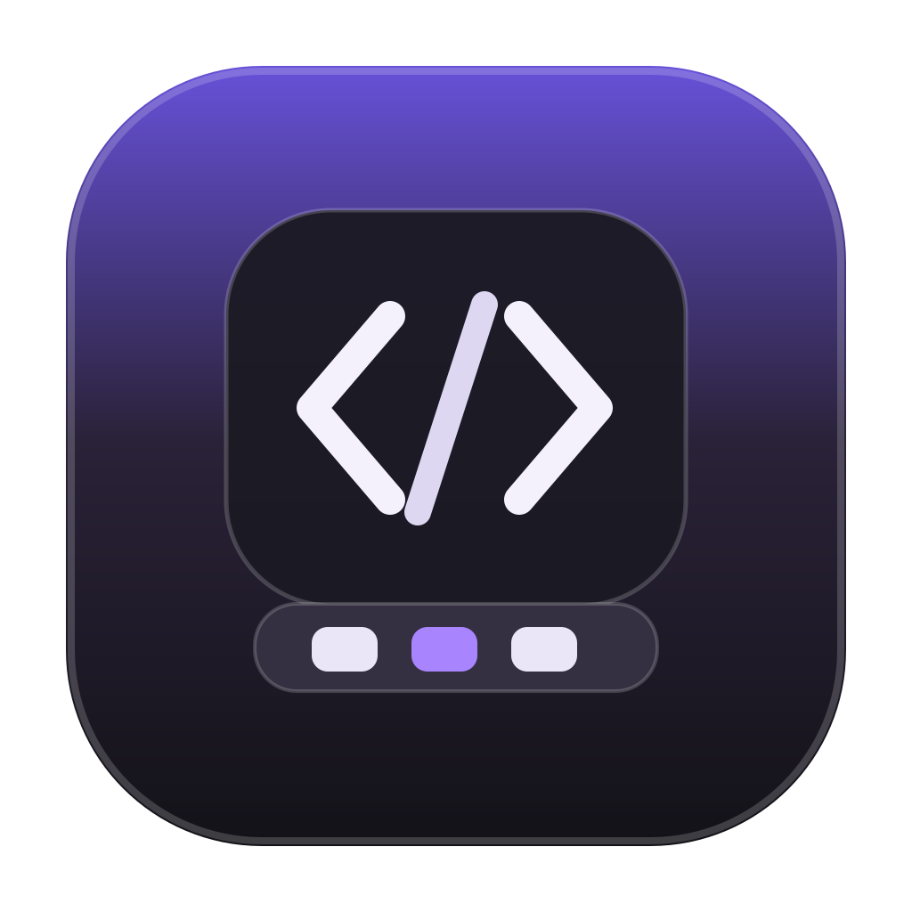
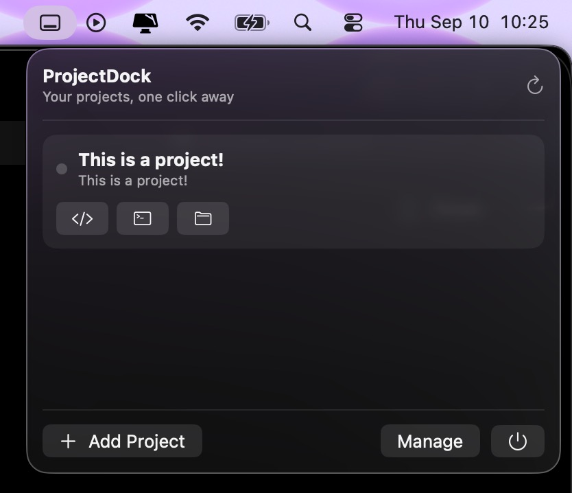
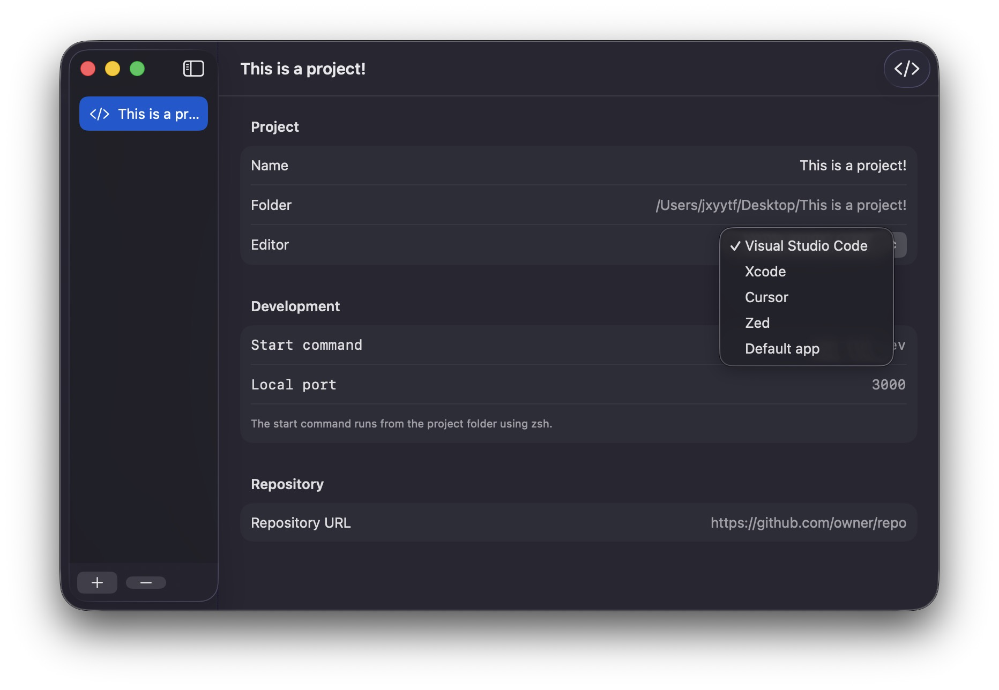

  

<h1 align="center">ProjectDock</h1>

<strong>Your development projects, one click away.</strong>

  A lightweight native macOS app for launching editors, terminals, repositories and local dev servers from one place.

  <a href="https://github.com/JayyBG/ProjectDock/releases/latest"><strong>Download the latest release</strong></a>
  ·
  <a href="#features">Features</a>
  ·
  <a href="#privacy">Privacy</a>

## Preview

### Menu bar

### Project manager

## Features

- Keep your local projects in a fast menu-bar launcher
- Open projects in Visual Studio Code, Xcode, Cursor, Zed, Finder, or Terminal
- Start and stop a saved development command for each project
- Open the local dev server for a configured localhost port
- Jump to a project's GitHub repository when one is set
- Manage names, folders, editors, commands, ports, and repository links in one native window
- Automatically pre-fill useful details when adding a folder
- Keep recently opened projects near the top
- Store everything locally, with no account or cloud sync required

## Install

1. Open the [latest release](https://github.com/JayyBG/ProjectDock/releases/latest).
2. Download `ProjectDock-v0.1.0.dmg` (or the newest `.dmg`).
3. Open the disk image.
4. Drag **ProjectDock** onto the **Applications** shortcut.
5. Eject the ProjectDock disk image and launch ProjectDock from Applications.

The downloadable build is ad-hoc signed but is not Apple-notarized yet. If macOS blocks the first launch, right-click **ProjectDock** in Applications and choose **Open**.

## How it works

Add a project folder once, then launch it from the menu bar whenever you need it. ProjectDock can keep a preferred editor, terminal command, repository link, and localhost port for each project.

When you add a folder, ProjectDock can pre-fill useful details such as:

- Project name from `package.json`
- Xcode project or workspace
- Git `origin` repository URL
- Common development commands such as `npm run dev` or `npm start`

## Requirements

- macOS 13 Ventura or newer
- Apple Silicon or Intel Mac

## Roadmap

- [ ] Search / command palette
- [ ] Auto-discover projects in chosen folders
- [ ] Custom actions per project
- [ ] Workspace groups
- [ ] Git branch + dirty state
- [ ] Built-in terminal output panel
- [ ] Better package-manager detection (`pnpm`, `yarn`, `bun`)
- [ ] Launch at login
- [ ] Import/export configuration
- [ ] `.projectdock.yml` support
- [ ] Docker service controls
- [ ] Keyboard shortcuts

## Privacy

ProjectDock has no account, analytics, cloud backend, or telemetry. Your project metadata stays on your Mac.

## License

ProjectDock is available under the [MIT License](LICENSE).
